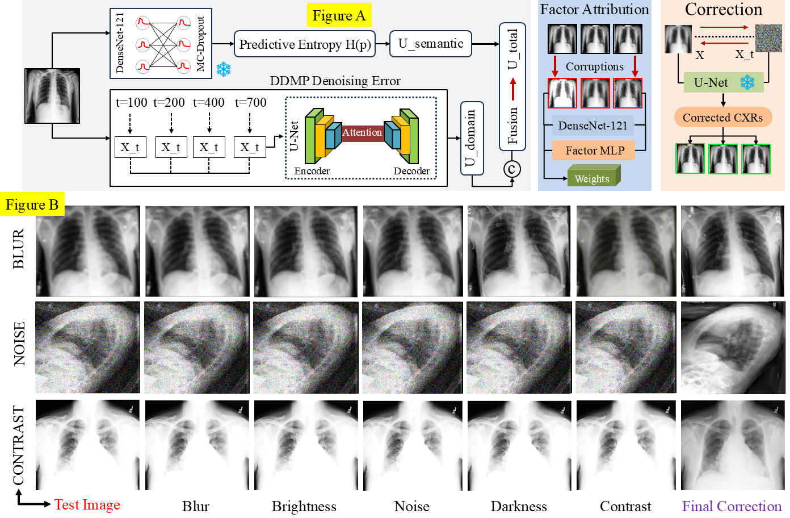

# CD-DSD: Counterfactual Diffusion-based Domain Shift Detection for Chest X-ray Analysis

> *ICASSP 2026 — under review*

---

## Overview

**CD-DSD** is a domain shift detection framework for chest X-ray (CXR) analysis. It addresses a core clinical deployment challenge: a model trained on one hospital's CXR distribution (e.g., CheXpert) may silently degrade when applied to images from a different scanner, acquisition protocol, or institution. CD-DSD detects this degradation *before* prediction errors occur, and attributes the shift to interpretable clinical factors.

The framework decomposes per-image uncertainty into two complementary signals:

- **U_domain** — diffusion denoising error, measuring how far the test image lies from the training distribution in reconstruction space.
- **U_semantic** — MC-Dropout predictive entropy, measuring the classifier's inherent ambiguity about the pathology prediction.

A lightweight **FactorMLP** then attributes the detected domain shift to one of four interpretable factors: *brightness/contrast*, *noise/texture*, *scanner artefact*, or *global structure*. Finally, an **SDEdit-based counterfactual** partially corrects the test image back toward the source domain, providing visual evidence of what changed.

---

## Architecture

<p align="center">
  
</p>

**Figure A (top):** The CD-DSD inference pipeline. A test CXR is processed in parallel by (i) a frozen DenseNet-121 with MC-Dropout for U_semantic, and (ii) a frozen DDPM that computes multi-timestep denoising error for U_domain. The two signals are fused into U_total, and FactorMLP attributes the shift to interpretable factors. An SDEdit partial correction produces the domain-corrected counterfactual x*.

**Figure B (bottom):** Qualitative results across three corruption types (blur, noise, contrast). Each row shows the original test image followed by five factor-level partial corrections, ending with the full counterfactual correction (purple border).

---

## Results

### Comparison with State-of-the-Art Methods

| Method | CheXpert AUC | CheXpert Acc | CheXpert ECE | MIMIC-CXR AUC | MIMIC-CXR Acc | MIMIC-CXR ECE | NIH AUC | NIH Acc | NIH ECE |
|---|:---:|:---:|:---:|:---:|:---:|:---:|:---:|:---:|:---:|
| MSP | 0.814±0.018 | 89.7±0.7 | 0.071±0.006 | 0.847±0.017 | 90.1±0.6 | 0.064±0.006 | 0.802±0.019 | 88.5±0.8 | 0.076±0.007 |
| MD | 0.942±0.012 | 95.9±0.5 | 0.039±0.004 | 0.947±0.011 | 94.3±0.6 | 0.043±0.004 | 0.913±0.014 | 92.7±0.7 | 0.051±0.005 |
| Energy | 0.800±0.019 | 83.3±0.8 | 0.084±0.007 | 0.843±0.018 | 85.6±0.7 | 0.076±0.006 | 0.816±0.020 | 81.7±0.8 | 0.089±0.008 |
| ReAct | 0.798±0.021 | 73.8±0.9 | 0.112±0.009 | 0.767±0.022 | 74.6±0.8 | 0.105±0.008 | 0.714±0.024 | 71.3±1.0 | 0.121±0.010 |
| ViM | 0.914±0.015 | 92.2±0.6 | 0.052±0.005 | 0.943±0.013 | 93.6±0.5 | 0.045±0.004 | 0.906±0.016 | 91.4±0.7 | 0.057±0.005 |
| KNN | 0.918±0.010 | 93.1±0.6 | 0.048±0.004 | 0.929±0.013 | 95.1±0.5 | 0.041±0.004 | 0.912±0.017 | 90.4±0.7 | 0.055±0.005 |
| DICE | 0.796±0.020 | 78.9±0.9 | 0.096±0.008 | 0.776±0.021 | 76.5±1.0 | 0.103±0.009 | 0.754±0.022 | 74.3±1.0 | 0.111±0.009 |
| GEN | 0.619±0.025 | 62.3±1.1 | 0.137±0.011 | 0.601±0.026 | 59.1±1.2 | 0.149±0.012 | 0.594±0.027 | 59.5±1.1 | 0.142±0.011 |
| ASH | 0.835±0.017 | 82.6±0.7 | 0.078±0.006 | 0.820±0.018 | 81.9±0.7 | 0.081±0.007 | 0.820±0.017 | 82.8±0.7 | 0.075±0.006 |
| DDA | 0.599±0.024 | 61.6±1.0 | 0.128±0.010 | 0.603±0.025 | 60.1±1.1 | 0.135±0.011 | 0.604±0.024 | 60.1±1.0 | 0.131±0.010 |
| DiffPath | 0.531±0.029 | 52.1±1.2 | 0.156±0.012 | 0.511±0.030 | 51.6±1.3 | 0.162±0.013 | 0.521±0.029 | 51.6±1.2 | 0.158±0.012 |
| EigenScore | 0.602±0.025 | 61.9±1.0 | 0.119±0.010 | 0.616±0.024 | 62.3±1.0 | 0.115±0.009 | 0.610±0.024 | 59.9±1.1 | 0.123±0.010 |
| **CD-DSD*** | **0.962±0.018** | **96.3±0.8** | **0.021±0.003** | **0.955±0.020** | **96.8±0.7** | **0.024±0.003** | **0.958±0.019** | **97.5±0.6** | **0.019±0.003** |

Bold denotes the best score. Lower ECE indicates better calibration. * indicates statistical significance (DeLong's test, p < 0.05).

---

## Installation

```bash
git clone https://github.com/dawoodrehman44/CD-DSD.git
cd CD-DSD
pip install -r requirements.txt
```

Python 3.9+ and PyTorch 2.0+ with CUDA are recommended.

---

## Dataset Setup

CD-DSD is trained on [CheXpert](https://stanfordmlgroup.github.io/competitions/chexpert/) and evaluated on [MIMIC-CXR](https://physionet.org/content/mimic-cxr-jpg/2.0.0/) and [NIH ChestX-Ray14](https://nihcc.app.box.com/v/ChestXray-NIHCC). After downloading, update the paths in `cd_dsd/config.py`:

```python
CHEXPERT_IMAGE_ROOT = "/path/to/CheXpert-v1.0/train/"
CHEXPERT_TRAIN_CSV  = "/path/to/chexpert_train.csv"
CHEXPERT_VALID_CSV  = "/path/to/chexpert_valid.csv"

MIMIC_IMAGE_ROOT    = "/path/to/mimic-cxr/jpg"
MIMIC_TRAIN_CSV     = "/path/to/mimic_train.csv"
MIMIC_VALID_CSV     = "/path/to/mimic_valid.csv"

NIH_IMAGE_ROOT      = "/path/to/ChestX-Ray8/images"
NIH_CSV             = "/path/to/Data_Entry_2017_v2020.csv"
```

---

## Pretrained Checkpoints

| Model | Description | Download |
|---|---|---|
| `classifier_best.pt` | DenseNet-121 (8-class CheXpert, MC-Dropout) | Coming soon |
| `diffusion_best.pt` | DDPM trained on CheXpert (224×224) | Coming soon |
| `factor_classifier.pt` | FactorMLP (4-factor attribution) | Coming soon |

Place downloaded checkpoints in `checkpoints/`.

---

## Quick Start

```python
import torch
from cd_dsd import Config, CDDSDDiagnoser, get_eval_transform

cfg       = Config()
diagnoser = CDDSDDiagnoser(cfg)
transform = get_eval_transform(cfg.IMAGE_SIZE, cfg.MEAN, cfg.STD)

from PIL import Image
img = Image.open("path/to/cxr.jpg").convert("RGB")
x   = transform(img).unsqueeze(0).to(diagnoser.device)

results = diagnoser.diagnose_batch(x, domain="external", save_vis=True)
r = results[0]
print(f"U_total:    {r['u_total']:.4f}")
print(f"U_domain:   {r['u_domain']:.4f}")
print(f"U_semantic: {r['u_semantic']:.4f}")
print(f"Top factor: {max(r['factor_attributions'], key=r['factor_attributions'].get)}")
```

---

## Module Structure

```
CD-DSD/
├── cd_dsd/
│   ├── config.py          # All hyperparameters and dataset paths
│   ├── datasets.py        # CheXpert, MIMIC-CXR, NIH dataset classes
│   ├── classifier.py      # MCDropoutClassifier (DenseNet-121)
│   ├── unet.py            # U-Net architecture for the DDPM
│   ├── diffusion.py       # DDPM forward/reverse process, DDIM sampling, SDEdit
│   ├── diagnoser.py       # CDDSDDiagnoser: calibration, scoring, visualisation
│   ├── factor_mlp.py      # FactorMLP, FactorAttributor, corruption utilities
│   ├── baselines.py       # 12 OOD baseline methods (MSP → EigenScore)
│   ├── utils.py           # Logging, CSV saving, directory helpers
│   └── __init__.py        # Public API
├── assets/
│   └── architecture.png   # Architecture figure
├── requirements.txt
└── README.md
```

---

## Method Summary

CD-DSD combines components that each address a distinct failure mode of existing OOD detectors on medical images:

| Component | What it detects | Why existing methods miss it |
|---|---|---|
| DDPM denoising error | Structural and photometric shifts | Feature-space methods are blind to pixel-level distribution statistics |
| MC-Dropout entropy | Pathology ambiguity | Domain score alone cannot distinguish scanner vs. disease uncertainty |
| FactorMLP attribution | Which factor caused the shift | Existing methods produce a scalar score with no interpretable breakdown |
| SDEdit counterfactual | Visual evidence of domain correction | No existing OOD method produces an interpretable corrected image |

---

## Citation

```bibtex
```

---

## Acknowledgements

- [CheXpert](https://stanfordmlgroup.github.io/competitions/chexpert/) — Stanford ML Group
- [MIMIC-CXR](https://physionet.org/content/mimic-cxr-jpg/2.0.0/) — PhysioNet
- [NIH ChestX-Ray14](https://nihcc.app.box.com/v/ChestXray-NIHCC) — NIH Clinical Center
- DDPM implementation inspired by [Ho et al. (2020)](https://arxiv.org/abs/2006.11239)
- SDEdit from [Meng et al. (2022)](https://arxiv.org/abs/2108.01073)
